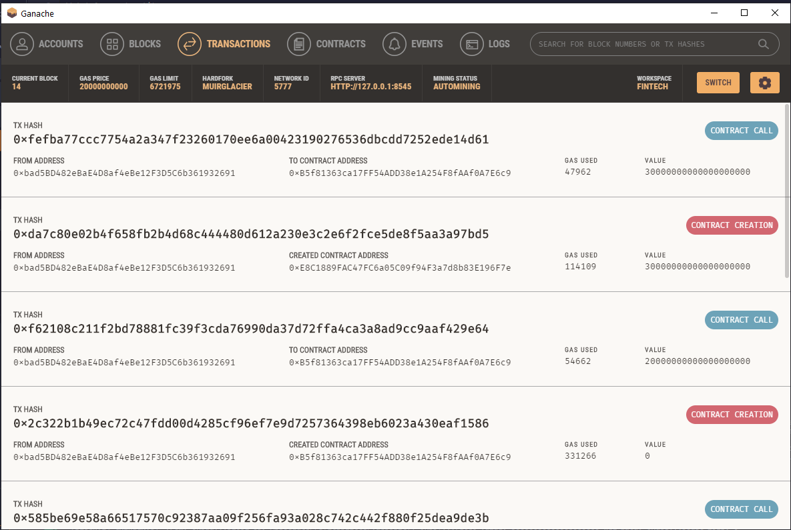
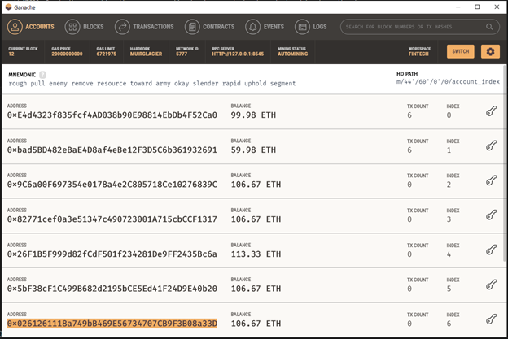
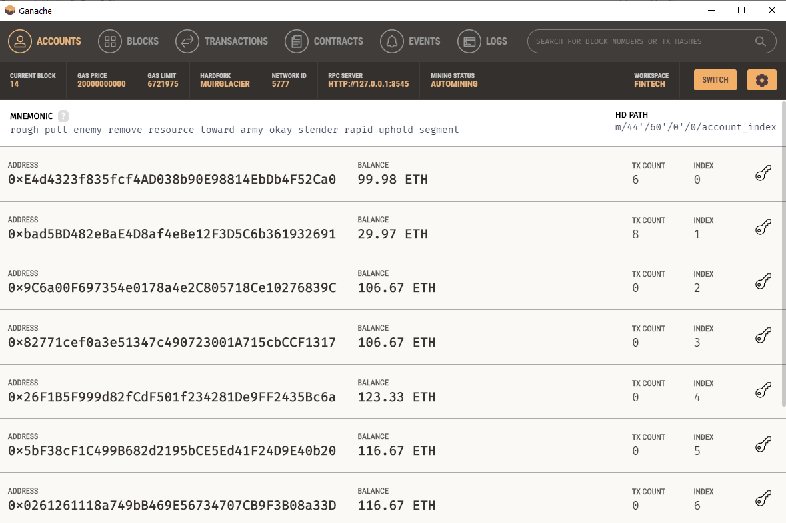
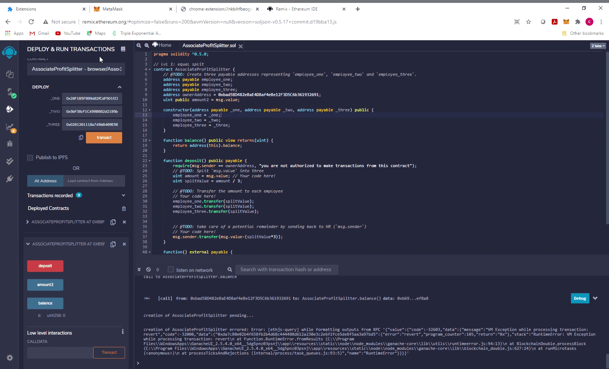

# solidity_profit_splits

This contract is designed to split in 3 parts any deposit originated from the owner of the contract. The owner of the contract is the address that deployed the contract, and also it is the only one allowed to call the contract (execute transactions).

To ensure that there is "only" one owner, the address was hard-coded in the blockchain, however the recipients must be input every time that a transaction is ordered.

## The Blockchain Contract:

The contract consist of a constructor function, 2 defined functions and one fallback function.

&ensp; The constructor function is used to define the addresses of the three recipients when the contract is deployed; then after that those addresses will be fixed. If there is any change in the recipient addresses, the contract would need to be re-deployed. 

Notice, how `Ganache` differentiates the contract creation with a red button while the contract call is marked with blue color. 

## Testing the code:

The code was tested executing transfers from the account: `0xbad5BD482eBaE4D8af4eBe12F3D5C6b361932691` while the receiving accounts where the following five addresses from `ganache` addresses list (refer to below image ) 

A total of three transactions were executed from this account: 2 transactions were 20 Ether while the third transaction was 30 Ether.

